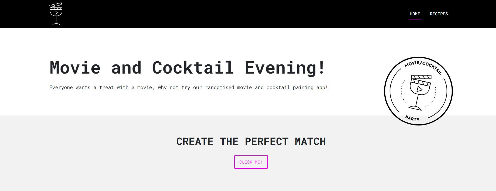
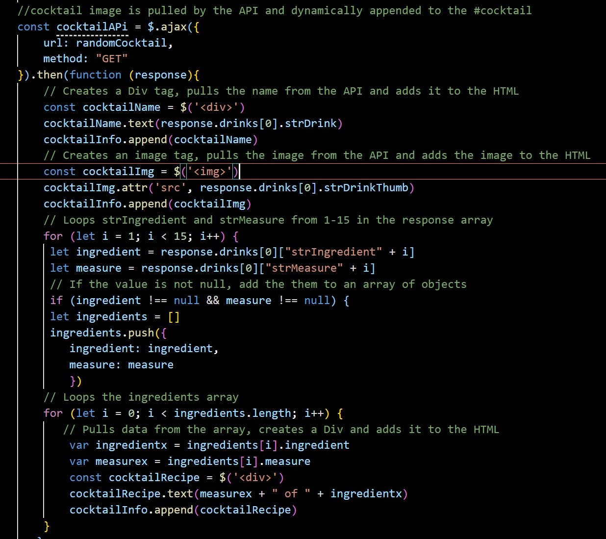
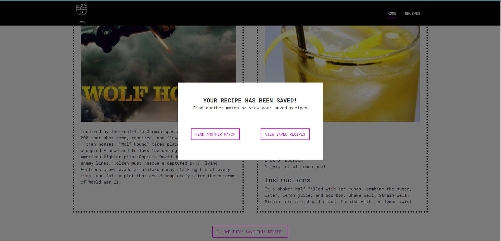

# MovieSlashCocktailParty
Creating an app that allows a user to select cocktails to watch with specific movies.

## Description 
This was a team project by "The Lost".

We identified a desperate need in the market. People were systematically failing to choose the correct movie to be shown at their parties, and even more concerning, they didn’t know which cocktail would enhance the experience.

Our goals were:
    - To use both a cocktail and movie API to enhance party planning,
    - The use client-side storage to allow users to save combinations   they like,
    - To use bootstrap and modals to show a modern, well organised website,
    - Most importantly, we wanted user input to dictate the response.

We used the following technologies while adopting an agile workflow:

    - Github
    - Visual Studio Code
        - JavaScript
        - HTML
        - CSS
        - Bootstrap
        
*** Disclaimer: some cocktails do not get displayed properly when saved. We have diagnosed that this is due to the API naming synatx which for a few cocktails is different than the others (vermouth cassis). Additionally, upon first use of the application, if you inspect and open up the console, there will be some errors, this is to be ignored and will fix itself once the application is first used.

## Usage
The deployed application can be found at:

https://resonantdevotion.github.io/MovieSlashCocktailParty/ 

Once the user enters the page they can see the full web application.

At the top of the page the user can find the navigation bar that allows them to move between pages.Here the user can access the home page by clicking at the Home item or the Recipes page by clicking on the Recipe item.

Moving along let us discuss the usage of the Home page.
Here the user can use the page to find match of cocktail and movie at random  by simply clicking the  CLICK ME! button.

Depending on the user preference if the user likes a combo and the cocktail specifically , they can simply save the cocktail and its recipe for their use later on by clicking the  I LOVE THIS! SAVE THIS RECIPE! button.

Once the I LOVE THIS! SAVE THIS RECIPE!  button is clicked the user receives a pop up that their Recipe has been saved. This pop up also allows the user to continue finding new results in the home page or direct them to the recipe page where their coctails are stored.

Moving to the Recipe page the user can access their saved recipes by clicking on the specific cocktail name

Simlarly users have the ability  to clear a specific cocktail off the saved list.

Lastly if the user feels they want to search for more recipes to save they can simply click the GET ME ANOTHER MATCH button.

## Credits
Amelia Bramwell, Benjamin Cottrell, Haris Haider, and Rebecca Wood.

## License
MIT license - Please see the License in the Repo.

## Contributing
For contributions please find us on the skills bootcamp slack channel!

---

© 2022 edX Boot Camps LLC. Confidential and Proprietary. All Rights Reserved.

